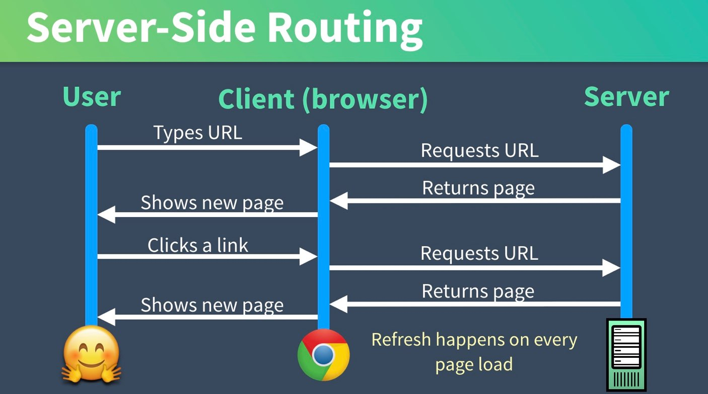

# Vue Router les bases

## Server-Side vs Client-Side Routing

Dans un site web classique, nous connections les pages avec des liens. Les liens font des appels au serveur et le serveur nous renvoie la page suivante. Puis nous recommençons en cliquant sur un nouveau lien, vers une autre page.



Une application de page unique (SPA -> Single Page Application) est définie comme une application Web qui se charge à partir d'une seule page et met à jour dynamiquement cette page lorsque l'utilisateur interagit avec l'application. Cependant, si nous utilisons une application d'une seule page, nous avons besoin d'un moyen de naviguer entre les contenus (routage côté client).

Avec VueJs, et plus généralement dans une SPA, cela qui signifie que le routage se produit dans le navigateur lui-même à l'aide de JavaScript. Notre page Web est chargée à partir d'une seule page `index.html` et nous pouvons utiliser le routage côté client pour présenter dynamiquement différentes vues, selon le lien sur lequel vous cliquez. Souvent, la vue que nous devons afficher a déjà été chargée dans le navigateur, nous n'avons donc pas besoin de contacter le serveur pour cela.


Vue Router est un router officiellement supporté par Vue.js. Il permet de gérer la navigation dans les applications Vue.js en utilisant une approche basée sur les composants.

## Installation de Vue Router

Pour utiliser Vue Router dans votre projet Vue.js, vous devez d'abord l'installer via npm ou yarn :

```bash
npm install vue-router
```

## Configuration de Vue Router

Une fois installé, vous devez configurer Vue Router dans votre application. Habituellement, cela se fait dans le fichier principal `main.js` de votre projet Vue.js.

Exemple de configuration de Vue Router :

```js:src/main.js
import { createApp } from 'vue';
import App from './App.vue';
import { createRouter, createWebHistory } from 'vue-router';

// ici la liste de vos différentes pages sous la forme de composants
import Home from './components/Home.vue';
import About from './components/About.vue';
import Contact from './components/Contact.vue';

// ici on indique la route pour atteindre chaque pages
const routes = [
  { path: '/', component: Home },
  { path: '/about', component: About },
  { path: '/contact', component: Contact }
];

const router = createRouter({
  history: createWebHistory(),
  routes
});

const app = createApp(App);
app.use(router);
app.mount('#app');
```

Dans cet exemple, nous avons défini trois routes (`/`, `/about` et `/contact`) avec leur composant correspondant. Ensuite, nous avons créé une instance de router en utilisant `createRouter()` et en lui passant les options de configuration et les routes définies. Enfin, nous avons utilisé `app.use(router)` pour installer le router dans l'application Vue.

## Utilisation de Vue Router dans les Composants

Une fois configuré, vous pouvez utiliser Vue Router dans vos composants en utilisant les composants `router-link` et `router-view`.

Exemple d'utilisation de `router-link` :

```vue:src/App.vue
<template>
  <div>
    <nav>
      <router-link to="/">Accueil</router-link>
      <router-link to="/about">À Propos</router-link>
      <router-link to="/contact">Contact</router-link>
    </nav>
    <router-view></router-view>
  </div>
</template>
```

Dans cet exemple, nous utilisons `router-link` pour définir des liens vers différentes routes de l'application. Lorsque l'utilisateur clique sur un lien, Vue Router gère la navigation vers la route correspondante et affiche le composant correspondant dans `router-view`.

## Routage Dynamique

Vue Router prend également en charge le routage dynamique, les paramètres de route, les paramètres de requête, les redirections, les guards de navigation, et bien plus encore. Vous pouvez personnaliser le comportement de la navigation en fonction des besoins spécifiques de votre application.

### Navigation Programmée et Déclarative

Vue Router permet de naviguer dans l'application de manière programmée en utilisant des méthodes comme `push` et `replace`, ainsi que de manière déclarative en utilisant des balises `<router-link>`.

#### Avec la Composition API

```vue:src/components/Navigation.vue
<template>
  <div>
    <button @click="goHome">Aller à l'accueil</button>
    <button @click="goToUser(123)">Voir utilisateur 123</button>
    <button @click="goBack">Retour</button>
  </div>
</template>

<script setup>
import { useRouter } from 'vue-router'

const router = useRouter()

const goHome = () => {
  router.push('/')
}

const goToUser = (userId) => {
  router.push(`/user/${userId}`)
}

const goBack = () => {
  router.back()
}
</script>
```

#### Avec l'Options API

```vue:src/components/NavigationOptions.vue
<template>
  <div>
    <button @click="goHome">Aller à l'accueil</button>
    <button @click="goToUser(123)">Voir utilisateur 123</button>
  </div>
</template>

<script>
export default {
  methods: {
    goHome() {
      this.$router.push('/')
    },
    goToUser(userId) {
      this.$router.push(`/user/${userId}`)
    }
  }
}
</script>
```

Exemple de navigation déclarative :

```vue
<router-link to="/">Accueil</router-link>
```

### Gestion des Paramètres

Vue Router permet de passer des paramètres dans les routes, ce qui permet de créer des routes dynamiques.

Exemple de définition de route avec paramètre :

```js
const routes = [
  {
    path: '/user/:id',
    component: User
  }
];
```

Exemple d'utilisation du paramètre dans le composant :
```vue
<template>
  <div>
    <p>ID de l'utilisateur : {{ $route.params.id }}</p>
  </div>
</template>
```

### Navigation Protégée

Vue Router permet de protéger certaines routes en ajoutant une fonction de navigation (`beforeEach`) pour vérifier l'authentification de l'utilisateur avant de lui permettre d'accéder à une route protégée.

#### Configuration des guards globaux

```js:src/router/index.js
import { createRouter, createWebHistory } from 'vue-router'
import { useAuthStore } from '@/stores/auth'

const router = createRouter({
  history: createWebHistory(),
  routes: [
    {
      path: '/dashboard',
      component: Dashboard,
      meta: { requiresAuth: true }
    },
    {
      path: '/login',
      component: Login
    }
  ]
})

router.beforeEach((to, from, next) => {
  const authStore = useAuthStore()
  
  if (to.meta.requiresAuth && !authStore.isAuthenticated) {
    next('/login')
  } else {
    next()
  }
})

export default router
```

#### Guards de composant avec la Composition API

```vue:src/components/Dashboard.vue
<template>
  <div>
    <h1>Tableau de bord</h1>
    <p>Bienvenue {{ user.name }}</p>
  </div>
</template>

<script setup>
import { ref, onMounted } from 'vue'
import { onBeforeRouteEnter, onBeforeRouteLeave } from 'vue-router'
import { useAuthStore } from '@/stores/auth'

const authStore = useAuthStore()
const user = ref({})

// Guard avant d'entrer dans le composant
onBeforeRouteEnter((to, from, next) => {
  if (authStore.isAuthenticated) {
    next()
  } else {
    next('/login')
  }
})

// Guard avant de quitter le composant
onBeforeRouteLeave((to, from, next) => {
  const answer = window.confirm('Êtes-vous sûr de vouloir quitter ?')
  if (answer) {
    next()
  } else {
    next(false)
  }
})

onMounted(() => {
  user.value = authStore.user
})
</script>
```

#### Guards de composant avec l'Options API

```vue:src/components/DashboardOptions.vue
<template>
  <div>
    <h1>Tableau de bord</h1>
    <p>Bienvenue {{ user.name }}</p>
  </div>
</template>

<script>
export default {
  data() {
    return {
      user: {}
    }
  },
  beforeRouteEnter(to, from, next) {
    // Vérification avant d'entrer dans la route
    if (this.$store.getters.isAuthenticated) {
      next()
    } else {
      next('/login')
    }
  },
  beforeRouteLeave(to, from, next) {
    const answer = window.confirm('Êtes-vous sûr de vouloir quitter ?')
    if (answer) {
      next()
    } else {
      next(false)
    }
  }
}
</script>
```

### Gestion des Query Parameters

#### Avec la Composition API

```vue:src/components/ProductList.vue
<template>
  <div>
    <h1>Liste des produits</h1>
    <input v-model="searchQuery" @input="updateSearch" placeholder="Rechercher...">
    <select v-model="selectedCategory" @change="updateCategory">
      <option value="">Toutes les catégories</option>
      <option value="electronics">Électronique</option>
      <option value="clothing">Vêtements</option>
    </select>
    <div>
      <p>Recherche: {{ searchQuery }}</p>
      <p>Catégorie: {{ selectedCategory }}</p>
    </div>
  </div>
</template>

<script setup>
import { ref, watch } from 'vue'
import { useRoute, useRouter } from 'vue-router'

const route = useRoute()
const router = useRouter()

const searchQuery = ref(route.query.search || '')
const selectedCategory = ref(route.query.category || '')

const updateSearch = () => {
  router.push({
    query: {
      ...route.query,
      search: searchQuery.value || undefined
    }
  })
}

const updateCategory = () => {
  router.push({
    query: {
      ...route.query,
      category: selectedCategory.value || undefined
    }
  })
}

// Réagir aux changements de query parameters
watch(() => route.query, (newQuery) => {
  searchQuery.value = newQuery.search || ''
  selectedCategory.value = newQuery.category || ''
})
</script>
```

## Conclusion

Vue Router est une bibliothèque puissante qui permet de gérer la navigation dans les applications Vue.js de manière simple et flexible. Avec la Composition API, l'accès aux fonctionnalités du router se fait via les composables `useRouter()` et `useRoute()`, offrant une approche plus moderne et flexible pour gérer la navigation. En utilisant Vue Router, vous pouvez créer des applications avec une navigation fluide et une expérience utilisateur optimale.
