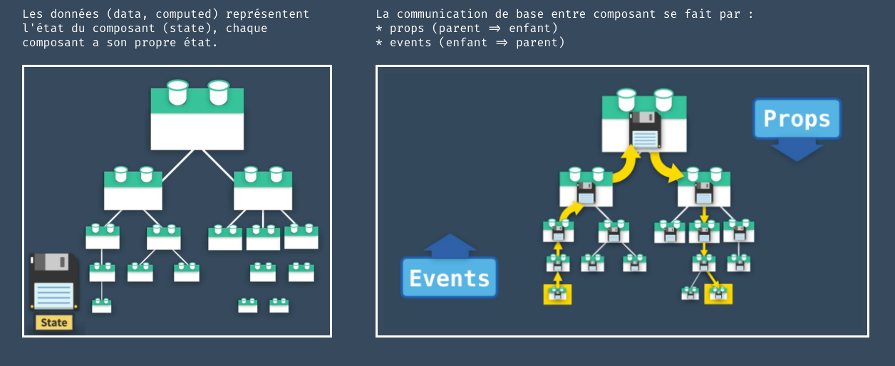
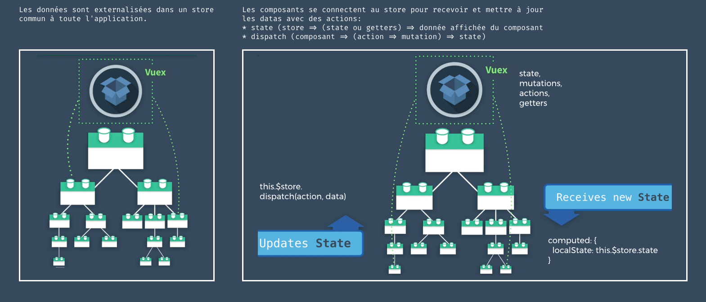

# Pourquoi utiliser un store ? et qu'est-ce qu'un store ?

Pinia est une bibliothèque de stockage (store) pour Vue, qui vous permet de partager un état entre tous les composants/pages.

Sans store, les données existent à l'intérieur d'un composant, mais sont isolées. Nous sommes obligés de faire communiquer les composants avec des `props` et des `$event` pour faire réagir un composant enfant ou un composant parent.



L'utilisation d'un store, permet d'extraire la logique du composant, et de la placer dans une "magazin de donnée", un store, externe au composant.
Celui-ci peut ainsi être appelé depuis n'importe où dans notre application, et ainsi maintenir un état commun à différents composants.



L'utilisation d'un store avec Pinia ou VueX est très utile :

- Support des outils de développement
- Une ligne de temps pour suivre les actions, les mutations
- Les stocks apparaissent dans les composants où ils sont utilisés
- Voyage dans le temps et débogage plus facile
- Remplacement à chaud des modules
- Modifiez vos magasins sans recharger votre page
- Conservez tout état existant pendant le développement
- Plugins : étendre les fonctionnalités de Pinia avec des plugins
- Support TypeScript ou autocomplétion pour les utilisateurs JS
- Support du rendu côté serveur

## Créer un store avec pinia

Pinia est une bibliothèque de gestion d'état pour les applications Vue.js. Elle fournit un moyen simple et efficace de gérer l'état global de votre application en utilisant des stores. Un store est un objet JavaScript qui contient l'état global de votre application, ainsi que des méthodes pour le modifier de manière réactive.

https://github.com/vuejs/pinia

Pour créer un store, il suffit de créer un nouveau fichier dans le dossier stores. Ce dossier existe car au moment de l'installation de notre projet, nous avons opté pour l'utilisation d'un store dans notre application.
Bien entendu il est toujours possible de l'ajouter après coup:

```bash
npm i pinia
```

puis l'importer dans `src/main.js`

```js:src/main.js
import { createApp } from 'vue'
import { createPinia } from 'pinia' //<<<---ajout ici
import App from './App.vue'

const pinia = createPinia()  //<<<---ajout ici
const app = createApp(App)

app.use(pinia) //<<<---ajout ici
app.mount('#app')
```

### Création d'un Store

Pinia offre deux syntaxes pour créer des stores : la syntaxe **Options** (similaire à l'Options API de Vue) et la syntaxe **Setup** (similaire à la Composition API).

#### Syntaxe Options Store

Cette syntaxe est similaire à l'Options API de Vue et est idéale pour les développeurs familiers avec cette approche.

```javascript:src/stores/counter.js
import { defineStore } from 'pinia'

export const useCounterStore = defineStore('counter', {
  // État initial du store (équivalent à data() dans un composant)
  state: () => ({
    count: 0,
    name: 'Eduardo'
  }),
  
  // Getters : propriétés calculées du store (équivalent à computed)
  getters: {
    // Getter simple qui retourne le double du count
    doubleCount: (state) => state.count * 2,
    
    // Getter avec accès à d'autres getters
    doubleCountPlusOne() {
      return this.doubleCount + 1
    },
    
    // Getter qui retourne une fonction (pour passer des paramètres)
    getCountMultipliedBy: (state) => {
      return (multiplier) => state.count * multiplier
    }
  },
  
  // Actions : méthodes du store (équivalent à methods)
  actions: {
    // Action simple pour incrémenter
    increment() {
      this.count++
    },
    
    // Action avec paramètre
    incrementBy(amount) {
      this.count += amount
    },
    
    // Action asynchrone (par exemple, appel API)
    async fetchUserData() {
      try {
        const response = await fetch('/api/user')
        const userData = await response.json()
        this.name = userData.name
      } catch (error) {
        console.error('Erreur lors du chargement des données:', error)
      }
    },
    
    // Action qui utilise d'autres actions
    reset() {
      this.count = 0
      this.name = 'Eduardo'
    }
  }
})
```

#### Syntaxe Setup Store (Composition API)

Cette syntaxe utilise la Composition API et offre plus de flexibilité. Elle est recommandée pour les nouveaux projets.

```javascript:src/stores/counterSetup.js
import { ref, computed } from 'vue'
import { defineStore } from 'pinia'

export const useCounterStore = defineStore('counter', () => {
  // État : utilisation de ref() pour les données réactives
  const count = ref(0)
  const name = ref('Eduardo')
  
  // Getters : utilisation de computed() pour les propriétés calculées
  const doubleCount = computed(() => count.value * 2)
  
  const doubleCountPlusOne = computed(() => doubleCount.value + 1)
  
  // Getter avec paramètre : fonction qui retourne une fonction
  const getCountMultipliedBy = computed(() => {
    return (multiplier) => count.value * multiplier
  })
  
  // Actions : fonctions normales
  function increment() {
    count.value++
  }
  
  function incrementBy(amount) {
    count.value += amount
  }
  
  // Action asynchrone
  async function fetchUserData() {
    try {
      const response = await fetch('/api/user')
      const userData = await response.json()
      name.value = userData.name
    } catch (error) {
      console.error('Erreur lors du chargement des données:', error)
    }
  }
  
  function reset() {
    count.value = 0
    name.value = 'Eduardo'
  }
  
  // Retourner tout ce qui doit être exposé
  return {
    // État
    count,
    name,
    // Getters
    doubleCount,
    doubleCountPlusOne,
    getCountMultipliedBy,
    // Actions
    increment,
    incrementBy,
    fetchUserData,
    reset
  }
})
```

## Utiliser le store dans un composant

### Avec la Composition API (Recommandé)

La Composition API offre une approche plus moderne et flexible pour utiliser les stores Pinia.

```vue:src/components/CounterComposition.vue
<template>
  <div>
    <h2>Compteur avec Composition API</h2>
    
    <!-- Affichage direct des valeurs du store -->
    <p>Compteur: {{ counter.count }}</p>
    <p>Double: {{ counter.doubleCount }}</p>
    <p>Double + 1: {{ counter.doubleCountPlusOne }}</p>
    <p>Nom: {{ counter.name }}</p>
    <p>Compteur × 5: {{ counter.getCountMultipliedBy(5) }}</p>
    
    <!-- Boutons pour les actions -->
    <div>
      <button @click="counter.increment()">+1</button>
      <button @click="counter.incrementBy(5)">+5</button>
      <button @click="counter.reset()">Reset</button>
      <button @click="counter.fetchUserData()">Charger données</button>
    </div>
    
    <!-- Exemple avec des méthodes locales -->
    <div>
      <button @click="handleIncrement">Incrément local</button>
      <button @click="handleBigIncrement">+10 local</button>
    </div>
  </div>
</template>

<script setup>
import { useCounterStore } from '@/stores/counter'

// Récupération du store
const counter = useCounterStore()

// Méthodes locales qui utilisent le store
const handleIncrement = () => {
  counter.increment()
  console.log('Compteur incrémenté:', counter.count)
}

const handleBigIncrement = () => {
  counter.incrementBy(10)
}

// Si vous voulez destructurer (attention à la réactivité)
// import { storeToRefs } from 'pinia'
// const { count, doubleCount } = storeToRefs(counter)
// const { increment, reset } = counter
</script>
```

#### Destructuration avec storeToRefs

Quand vous voulez destructurer les propriétés du store, utilisez `storeToRefs` pour maintenir la réactivité :

```vue:src/components/CounterDestructured.vue
<template>
  <div>
    <h2>Compteur destructuré</h2>
    <p>Compteur: {{ count }}</p>
    <p>Double: {{ doubleCount }}</p>
    <p>Nom: {{ name }}</p>
    
    <button @click="increment">+1</button>
    <button @click="incrementBy(3)">+3</button>
    <button @click="reset">Reset</button>
  </div>
</template>

<script setup>
import { storeToRefs } from 'pinia'
import { useCounterStore } from '@/stores/counter'

const counterStore = useCounterStore()

// Destructuration des propriétés réactives (state + getters)
const { count, doubleCount, name } = storeToRefs(counterStore)

// Destructuration des actions (pas besoin de storeToRefs)
const { increment, incrementBy, reset } = counterStore
</script>
```

### Avec l'Options API

L'Options API reste supportée et peut être utile pour migrer des projets existants ou pour les développeurs préférant cette syntaxe.

#### Utilisation directe du store

```vue:src/components/CounterOptions.vue
<template>
  <div>
    <h2>Compteur avec Options API</h2>
    
    <!-- Accès direct via this.counterStore -->
    <p>Compteur: {{ counterStore.count }}</p>
    <p>Double: {{ counterStore.doubleCount }}</p>
    <p>Nom: {{ counterStore.name }}</p>
    
    <div>
      <button @click="counterStore.increment()">+1</button>
      <button @click="counterStore.incrementBy(5)">+5</button>
      <button @click="counterStore.reset()">Reset</button>
    </div>
    
    <!-- Utilisation via des méthodes locales -->
    <div>
      <button @click="handleIncrement">Incrément via méthode</button>
      <button @click="handleCustomIncrement">+7</button>
    </div>
  </div>
</template>

<script>
import { useCounterStore } from '@/stores/counter'

export default {
  name: 'CounterOptions',
  
  // Création du store dans data (ou computed)
  data() {
    return {
      counterStore: useCounterStore()
    }
  },
  
  // Ou mieux, dans computed pour une meilleure performance
  computed: {
    // Accès au store via computed
    store() {
      return useCounterStore()
    },
    
    // Propriétés calculées locales basées sur le store
    isCountPositive() {
      return this.counterStore.count > 0
    }
  },
  
  methods: {
    handleIncrement() {
      this.counterStore.increment()
      console.log('Nouveau count:', this.counterStore.count)
    },
    
    handleCustomIncrement() {
      this.counterStore.incrementBy(7)
    },
    
    async loadData() {
      await this.counterStore.fetchUserData()
      console.log('Données chargées pour:', this.counterStore.name)
    }
  },
  
  // Lifecycle hooks avec le store
  mounted() {
    console.log('Composant monté, count initial:', this.counterStore.count)
  }
}
</script>
```

#### Utilisation avec mapStores, mapState et mapActions (Legacy)

Cette approche était courante avec Vuex et reste disponible avec Pinia pour faciliter la migration :

```vue:src/components/CounterLegacy.vue
<template>
  <div>
    <h2>Compteur avec mappers (Legacy)</h2>
    
    <!-- Utilisation des propriétés mappées -->
    <p>Compteur: {{ count }}</p>
    <p>Double: {{ doubleCount }}</p>
    <p>Nom: {{ name }}</p>
    
    <div>
      <!-- Utilisation des actions mappées -->
      <button @click="increment">+1</button>
      <button @click="incrementBy(5)">+5</button>
      <button @click="reset">Reset</button>
    </div>
    
    <!-- Accès direct au store -->
    <p>Via store direct: {{ counterStore.count }}</p>
  </div>
</template>

<script>
import { mapStores, mapState, mapActions } from 'pinia'
import { useCounterStore } from '@/stores/counter'

export default {
  computed: {
    // Donne accès à this.counterStore
    ...mapStores(useCounterStore),
    
    // Mappe les propriétés du state et getters
    ...mapState(useCounterStore, ['count', 'name']),
    ...mapState(useCounterStore, {
      // Renommage possible
      doubleValue: 'doubleCount',
      userName: 'name'
    }),
    
    // Getter avec alias
    doubleCount() {
      return this.counterStore.doubleCount
    }
  },
  
  methods: {
    // Mappe les actions du store
    ...mapActions(useCounterStore, ['increment', 'reset']),
    ...mapActions(useCounterStore, {
      // Renommage des actions
      addAmount: 'incrementBy'
    }),
    
    // Méthode locale utilisant une action mappée
    handleBigIncrement() {
      this.addAmount(10)
    }
  },
  
  mounted() {
    // Exemple d'utilisation au chargement du composant
    this.increment()
    console.log('Count après increment:', this.count)
  }
}
</script>
```

## Exemple complet : Store de gestion d'utilisateurs

Voici un exemple plus complexe montrant un store pour gérer des utilisateurs :

### Store avec syntaxe Setup

```js:src/stores/users.js
import { ref, computed } from 'vue'
import { defineStore } from 'pinia'

export const useUsersStore = defineStore('users', () => {
  // État
  const users = ref([])
  const currentUser = ref(null)
  const loading = ref(false)
  const error = ref(null)
  
  // Getters
  const userCount = computed(() => users.value.length)
  
  const activeUsers = computed(() => 
    users.value.filter(user => user.active)
  )
  
  const getUserById = computed(() => {
    return (id) => users.value.find(user => user.id === id)
  })
  
  const isLoggedIn = computed(() => currentUser.value !== null)
  
  // Actions
  async function fetchUsers() {
    loading.value = true
    error.value = null
    
    try {
      const response = await fetch('/api/users')
      if (!response.ok) throw new Error('Erreur lors du chargement')
      
      const data = await response.json()
      users.value = data
    } catch (err) {
      error.value = err.message
      console.error('Erreur fetchUsers:', err)
    } finally {
      loading.value = false
    }
  }
  
  async function addUser(userData) {
    loading.value = true
    
    try {
      const response = await fetch('/api/users', {
        method: 'POST',
        headers: { 'Content-Type': 'application/json' },
        body: JSON.stringify(userData)
      })
      
      if (!response.ok) throw new Error('Erreur lors de la création')
      
      const newUser = await response.json()
      users.value.push(newUser)
      return newUser
    } catch (err) {
      error.value = err.message
      throw err
    } finally {
      loading.value = false
    }
  }
  
  function setCurrentUser(user) {
    currentUser.value = user
  }
  
  function logout() {
    currentUser.value = null
  }
  
  function clearError() {
    error.value = null
  }
  
  return {
    // État
    users,
    currentUser,
    loading,
    error,
    // Getters
    userCount,
    activeUsers,
    getUserById,
    isLoggedIn,
    // Actions
    fetchUsers,
    addUser,
    setCurrentUser,
    logout,
    clearError
  }
})
```

Utilisation du store Users avec Composition API

```vue:src/components/Users.vue
<template>
  <div>
    <h2>Gestion des utilisateurs</h2>
    
    <!-- Indicateur de chargement -->
    <div v-if="usersStore.loading" class="loading">
      Chargement en cours...
    </div>
    
    <!-- Affichage des erreurs -->
    <div v-if="usersStore.error" class="error">
      Erreur: {{ usersStore.error }}
      <button @click="usersStore.clearError()">×</button>
    </div>
    
    <!-- Statistiques -->
    <div class="stats">
      <p>Total utilisateurs: {{ usersStore.userCount }}</p>
      <p>Utilisateurs actifs: {{ usersStore.activeUsers.length }}</p>
      <p>Connecté: {{ usersStore.isLoggedIn ? 'Oui' : 'Non' }}</p>
    </div>
    
    <!-- Actions -->
    <div class="actions">
      <button @click="loadUsers" :disabled="usersStore.loading">
        Charger utilisateurs
      </button>
      <button @click="showAddForm = !showAddForm">
        Ajouter utilisateur
      </button>
    </div>
    
    <!-- Formulaire d'ajout -->
    <form v-if="showAddForm" @submit.prevent="handleAddUser" class="add-form">
      <input v-model="newUser.name" placeholder="Nom" required>
      <input v-model="newUser.email" type="email" placeholder="Email" required>
      <button type="submit" :disabled="usersStore.loading">Ajouter</button>
    </form>
    
    <!-- Liste des utilisateurs -->
    <div class="users-list">
      <div 
        v-for="user in usersStore.users" 
        :key="user.id"
        class="user-card"
        :class="{ active: user.active }"
      >
        <h3>{{ user.name }}</h3>
        <p>{{ user.email }}</p>
        <button @click="usersStore.setCurrentUser(user)">
          Sélectionner
        </button>
      </div>
    </div>
    
    <!-- Utilisateur sélectionné -->
    <div v-if="usersStore.currentUser" class="current-user">
      <h3>Utilisateur sélectionné:</h3>
      <p>{{ usersStore.currentUser.name }}</p>
      <button @click="usersStore.logout()">Déconnecter</button>
    </div>
  </div>
</template>

<script setup>
import { ref, onMounted } from 'vue'
import { useUsersStore } from '@/stores/users'

// Store
const usersStore = useUsersStore()

// État local du composant
const showAddForm = ref(false)
const newUser = ref({
  name: '',
  email: ''
})

// Méthodes
const loadUsers = async () => {
  await usersStore.fetchUsers()
}

const handleAddUser = async () => {
  try {
    await usersStore.addUser({ ...newUser.value })
    // Réinitialiser le formulaire
    newUser.value = { name: '', email: '' }
    showAddForm.value = false
  } catch (error) {
    console.error('Erreur lors de l\'ajout:', error)
  }
}

// Charger les utilisateurs au montage
onMounted(() => {
  loadUsers()
})
</script>

<style scoped>
.loading { color: blue; }
.error { 
  color: red; 
  background: #ffebee; 
  padding: 10px; 
  border-radius: 4px; 
}
.stats { 
  background: #f5f5f5; 
  padding: 15px; 
  border-radius: 4px; 
}
.user-card { 
  border: 1px solid #ddd; 
  padding: 10px; 
  margin: 5px 0; 
  border-radius: 4px; 
}
.user-card.active { border-color: green; }
.add-form { 
  background: #f9f9f9; 
  padding: 15px; 
  border-radius: 4px; 
}
.current-user { 
  background: #e3f2fd; 
  padding: 15px; 
  border-radius: 4px; 
}
</style>
```

Utilisation du store Users avec Options API

```vue:src/components/Users.vue
<template>
  <div>
    <h2>Gestion des utilisateurs (Options API)</h2>
    
    <!-- Statistiques avec computed locales -->
    <div class="stats">
      <p>Total: {{ userCount }}</p>
      <p>Actifs: {{ activeUsersCount }}</p>
      <p>Status: {{ connectionStatus }}</p>
    </div>
    
    <!-- Actions -->
    <div class="actions">
      <button @click="loadUsers" :disabled="loading">
        {{ loading ? 'Chargement...' : 'Charger utilisateurs' }}
      </button>
      <button @click="handleAddRandomUser">
        Ajouter utilisateur aléatoire
      </button>
    </div>
    
    <!-- Liste simplifiée -->
    <div class="users-list">
      <div v-for="user in users" :key="user.id" class="user-card">
        <span>{{ user.name }} ({{ user.email }})</span>
        <button @click="selectUser(user)">Sélectionner</button>
      </div>
    </div>
    
    <!-- Utilisateur actuel -->
    <div v-if="currentUser" class="current-user">
      <p>Utilisateur actuel: {{ currentUser.name }}</p>
      <button @click="logout">Déconnecter</button>
    </div>
  </div>
</template>

<script>
import { useUsersStore } from '@/stores/users'

export default {
  name: 'UserManagerOptions',
  
  data() {
    return {
      usersStore: useUsersStore()
    }
  },
  
  computed: {
    // Propriétés du store accessibles directement
    users() {
      return this.usersStore.users
    },
    
    currentUser() {
      return this.usersStore.currentUser
    },
    
    loading() {
      return this.usersStore.loading
    },
    
    userCount() {
      return this.usersStore.userCount
    },
    
    // Computed locales basées sur le store
    activeUsersCount() {
      return this.usersStore.activeUsers.length
    },
    
    connectionStatus() {
      return this.usersStore.isLoggedIn ? 'Connecté' : 'Déconnecté'
    },
    
    hasUsers() {
      return this.users.length > 0
    }
  },
  
  methods: {
    async loadUsers() {
      try {
        await this.usersStore.fetchUsers()
        console.log('Utilisateurs chargés:', this.users.length)
      } catch (error) {
        console.error('Erreur de chargement:', error)
      }
    },
    
    selectUser(user) {
      this.usersStore.setCurrentUser(user)
      console.log('Utilisateur sélectionné:', user.name)
    },
    
    logout() {
      this.usersStore.logout()
      console.log('Utilisateur déconnecté')
    },
    
    async handleAddRandomUser() {
      const randomUser = {
        name: `Utilisateur ${Date.now()}`,
        email: `user${Date.now()}@example.com`,
        active: Math.random() > 0.5
      }
      
      try {
        await this.usersStore.addUser(randomUser)
        console.log('Utilisateur ajouté:', randomUser.name)
      } catch (error) {
        console.error('Erreur lors de l\'ajout:', error)
      }
    },
    
    // Méthode utilisant un getter avec paramètre
    findUserById(id) {
      return this.usersStore.getUserById(id)
    }
  },
  
  // Lifecycle hooks
  async mounted() {
    console.log('Composant monté, chargement des utilisateurs...')
    await this.loadUsers()
  },
  
  // Watcher pour réagir aux changements du store
  watch: {
    'usersStore.error': {
      handler(newError) {
        if (newError) {
          alert(`Erreur détectée: ${newError}`)
        }
      },
      immediate: true
    },
    
    userCount(newCount, oldCount) {
      console.log(`Nombre d'utilisateurs: ${oldCount} → ${newCount}`)
    }
  }
}
</script>

```

## Communication entre stores

Les stores Pinia peuvent facilement communiquer entre eux :

```js:src/stores/auth.js
import { ref, computed } from 'vue'
import { defineStore } from 'pinia'
import { useUsersStore } from './users'

export const useAuthStore = defineStore('auth', () => {
  const token = ref(localStorage.getItem('token'))
  const isAuthenticated = computed(() => !!token.value)
  
  async function login(credentials) {
    try {
      const response = await fetch('/api/login', {
        method: 'POST',
        headers: { 'Content-Type': 'application/json' },
        body: JSON.stringify(credentials)
      })
      
      const data = await response.json()
      token.value = data.token
      localStorage.setItem('token', data.token)
      
      // Utilisation d'un autre store
      const usersStore = useUsersStore()
      usersStore.setCurrentUser(data.user)
      
      return data
    } catch (error) {
      throw new Error('Échec de la connexion')
    }
  }
  
  function logout() {
    token.value = null
    localStorage.removeItem('token')
    
    // Communication avec le store users
    const usersStore = useUsersStore()
    usersStore.logout()
  }
  
  return {
    token,
    isAuthenticated,
    login,
    logout
  }
})
```

## Pour aller plus loin

### Conseils et bonnes pratiques

1 - Choisir la bonne syntaxe :
    - Utilisez la syntaxe Setup pour les nouveaux projets
    - Utilisez la syntaxe Options pour migrer depuis Vuex
2 - Organisation des stores :
    - Un store par domaine métier (users, products, auth, etc.)
    - Gardez les stores focalisés et cohérents
3 - Gestion des erreurs :
    - Toujours gérer les erreurs dans les actions asynchrones
    - Stocker les erreurs dans le state pour les afficher dans l'UI
4 - Performance :
    - Utilisez storeToRefs() pour destructurer sans perdre la réactivité
    - Évitez de créer trop de getters complexes

Ressources utiles

- [Pinia CheatSheet](./links/Pinia-Cheat-Sheet.pdf)
- [Documentation officielle Pinia](https://pinia.vuejs.org/)
- [Exemples avancés avec Pinia](https://blog.logrocket.com/complex-vue-3-state-management-pinia/)
- [Exemple complet d'authentification](https://stackblitz.com/edit/vue-3-pinia-registration-login-example)
