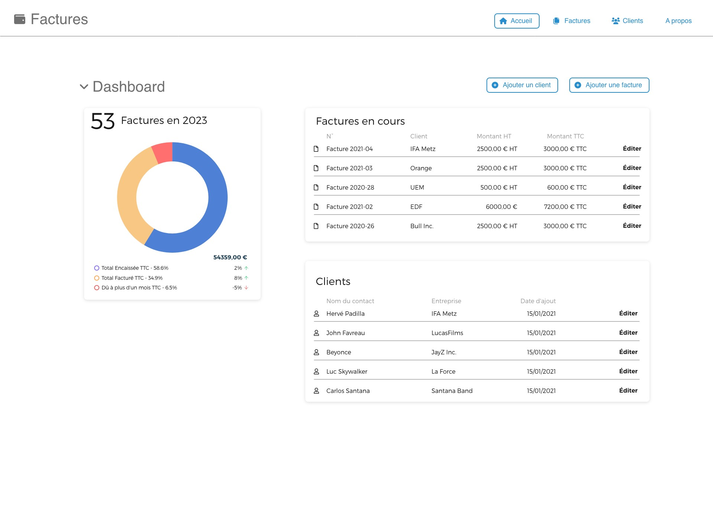

# VueJS / NodeJS

## Objectifs pédagogiques

- Créer une application complète de facturation en VueJS et NodeJS avec un API REST.
- Backend en NodeJs qui stocke les données dans un fichier JSON et effecture les opérations CRUD.
- Frontend complet en VueJS, avec un store Pinia, et vue-router.
- Documentation et test des routes de l'API avec le plugin VSCode ThunderClient

## Evaluation des connaissances : Exercice pratique

> Votre exercice consite à réaliser les vues manquantes de l'application telle que décrites sur les captures d'écrans jointes et la description détaillée qui suit.

* Créer une application de gestion de factures en vous basant sur les maquettes filaires jointes.
* Respecter l'architecture classique d'un projet VueJs en suivant les bonnes pratiques (utilisation du store, utilisation des routes avec vue-router).
* Utilisez Bootstrap et une bibliothèque d'icônes de votre choix (par ex. FontAwesome) pour embellir et structurer votre frontend
* Utilisez un backend NodeJS, écriture / lecture de fichiers JSON

## UX des écrans à réaliser

### si vous avez le temps

### super bonus

## Travail à rendre

### FRONTEND (Vuejs)

* Créer les vue de liste des clients et des factures (capture d'écran jointe pour le layout)
* Créer la vue d'édition/modification d'un client et d'une facture
* Créer un nouveau module du store `factures` qui contiendra la logique et l'état pour cette ressource
* Si vous avez le temps : Créer un nouveau module du store `client` qui contiendra la logique et l'état pour cette ressource
* Intégrer les stores dans les vues de l'application
* Si vous avez le temps : Attention, la liste des clients de l'écran de création/modification d'une facture, doit faire appel au store des clients, afin d'établire une relation entre les factures et les clients

### BACKEND (Nodejs avec édition de fichiers JSON)
  
* Créer un noveau modèle de donnée pour une facture
* Si vous avez le temps : Créer un noveau modèle de donnée pour un client
* Créer des nouvelles routes d'api pour gérer la nouvelle ressource côté backend
- Intégrer le CRUD pour les ressources `facture` et (si vous avez le temps) `client` :

L'API créé sera testée avec l'application Bruno () de VSCode ou bien l'application Bruno (https://www.usebruno.com/), tel que vu en cours. Vous ajouterez une collection de routes et les échantillons de données nécessaires aux tests de votre API. Les fichiers de configuration de Bruno devront être versionnés avec le projet.

### Objectif Bonus

En **objectif super bonus**, (et non obligatoire), vous pouvez terminer l'intégration de la vue du Dashboard en incluant un composant de graphique, ainsi que la liste des 10 derniers clients selon la capture d'écran ci-dessous.

**Des points bonus seront attribués aux stagiaires ayant complété les objectifs bonus.**

### Rendu de l'exercice

- Pour rendre votre projet, vous devrez me donner accès (au moins en lecture) au dépôt GIT du code de votre exercice finalisé. Compte GitHub à autoriser si votre projet est en privé : `@washaweb` adresse email: `<webmaster@washaweb.com>` (¡¡¡ sans les `node_modules` !!! )
- Si vous utilisez des variables d'environnement, n'oubliez pas de les inclure dans le fichier `.env` ou dans un fichier `env_template` du projet afin que je puisse reproduire votre environnement de travail.

> Afin de pouvoir reconnaître vos pseudos, n'oubliez pas de **mentionner votre nom complet** (dans le readme du projet, ou sur votre compte GitHub).
